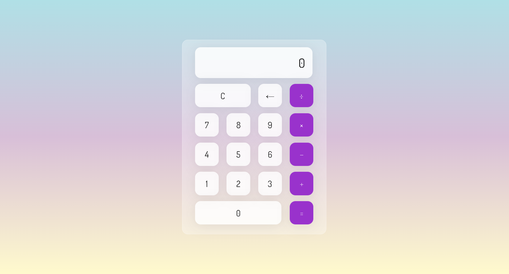

# Calculator
This repository contains a simple calculator application developed in HTML, CSS and Java. The calculator performs basic addition, subtraction, multiplication and division operations.

# Screenshot
Here we have project screenshot :

# Functionalities
- Performs basic arithmetic operations.
- Simple and intuitive interface.

# Installation
1. Clone this repository: git clone https://github.com/KaiqueCV/calculator-.git
2. Navigate to the project directory: cd calculator-
3. Open the index.html file in your browser

# How to use
- After opening the application in the browser, use the calculator buttons to perform arithmetic operations.
- Click the number buttons to enter the desired numbers.
- Click the operations buttons to perform corresponding actions.

## License
